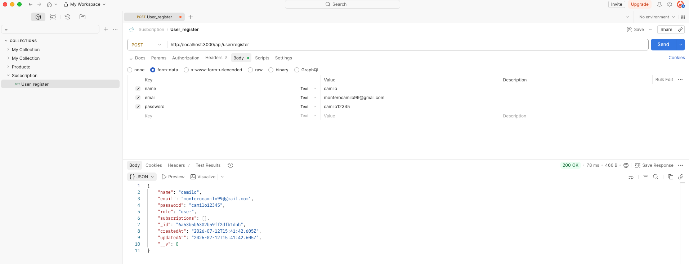
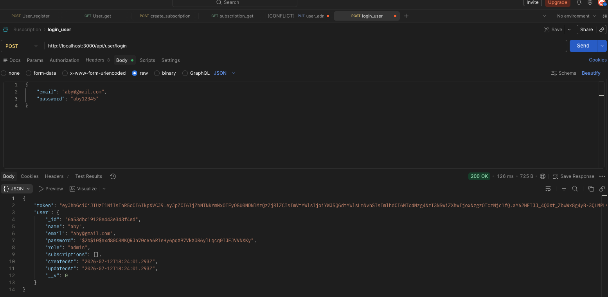
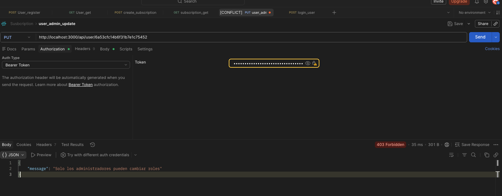
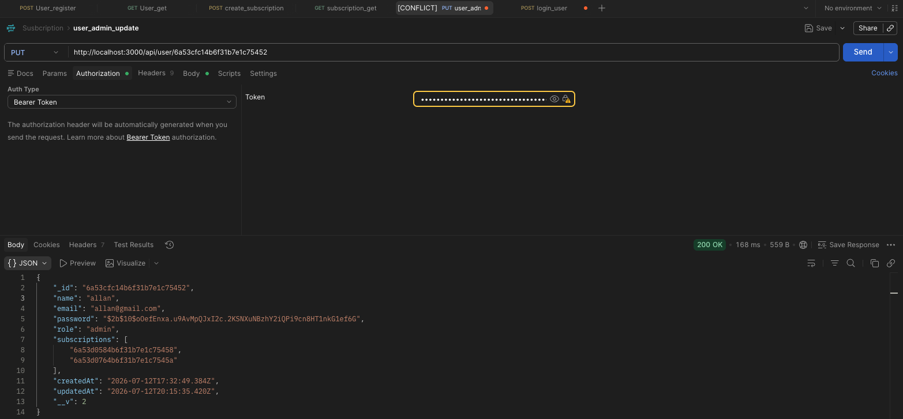
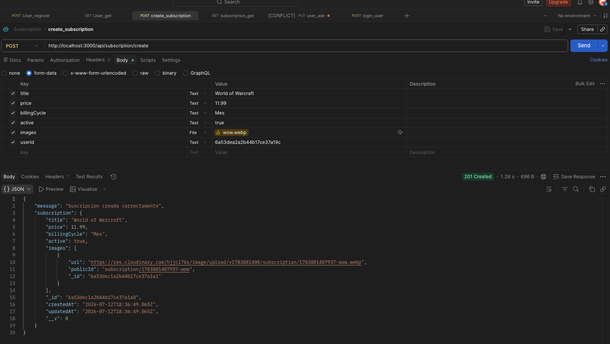
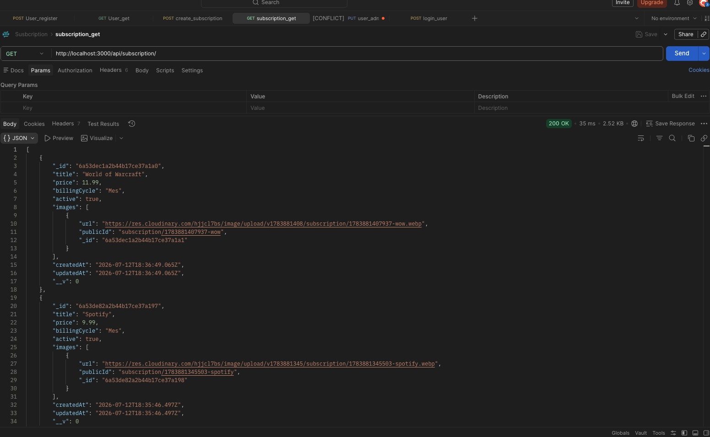
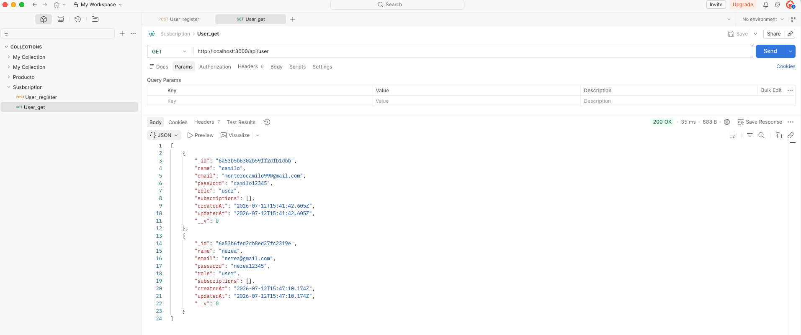
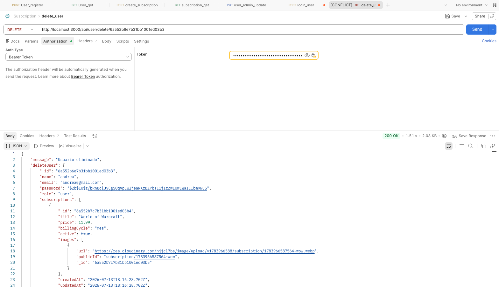
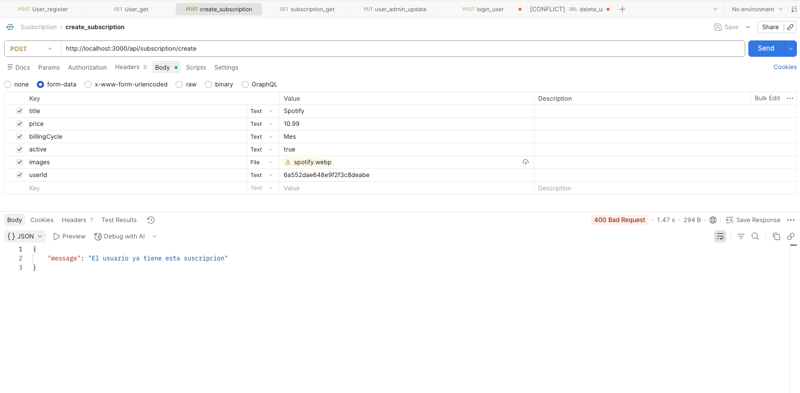
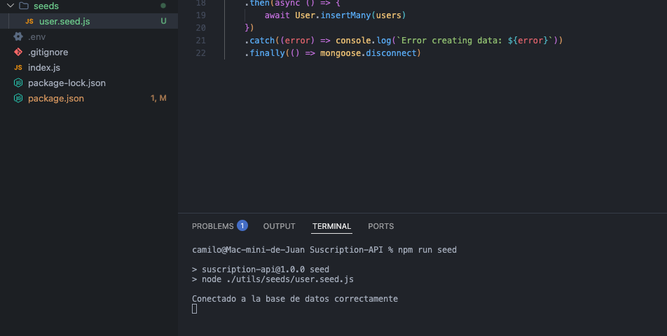

<h1 align="center">
🚀 Subscription API
</h1>

<p align="center">
Backend desarrollado con Node.js, Express y MongoDB para la gestión de usuarios, suscripciones, autenticación y almacenamiento de imágenes en Cloudinary.
</p>

<p align="center">
Proyecto desarrollado durante mi formación como Full Stack Developer.
</p>

---

# 📖 Descripción

Subscription API es una API REST diseñada para gestionar usuarios y suscripciones mediante una arquitectura organizada y escalable.

El proyecto incorpora autenticación mediante JSON Web Token, autorización basada en roles, relaciones entre colecciones de MongoDB y almacenamiento de imágenes en Cloudinary.

Durante su desarrollo he podido profundizar en conceptos fundamentales del desarrollo backend moderno, como la protección de rutas, la organización por capas y la gestión de recursos externos.

---

# ✨ Funcionalidades

## 👤 Usuarios

- Registro de usuarios.
- Inicio de sesión.
- Contraseñas cifradas con bcrypt.
- Perfil de usuario.
- Gestión de roles.

---

## 🔐 Autenticación

- Login mediante JWT.
- Middleware de autenticación.
- Protección de rutas privadas.
- Autorización basada en roles.
- Validación de permisos.

---

## 📦 Suscripciones

- Crear suscripciones.
- Consultar suscripciones.
- Eliminar suscripciones.
- Relación entre usuarios y suscripciones.

---

## ☁️ Cloudinary

- Subida de imágenes.
- Asociación de imágenes a las suscripciones.
- Eliminación automática de imágenes al borrar un recurso.

---

# 🛠️ Tecnologías

## Backend

- Node.js
- Express.js

## Base de datos

- MongoDB Atlas
- Mongoose

## Seguridad

- JSON Web Token (JWT)
- bcrypt

## Almacenamiento

- Cloudinary
- Multer

## Herramientas

- Postman
- GitHub
- Nodemon

---

# 📁 Arquitectura

```text
src
│
├── config/
├── controllers/
├── middlewares/
├── models/
├── routes/
├── utils/
└── app.js
```

---

# ⚙️ Instalación

Clonar repositorio

```bash
git clone https://github.com/juancamilo99-prog/Subscription-API.git
```

Instalar dependencias

```bash
npm install dependencias
```

Crear archivo `.env`

```env
El archivo .env se subira visiblemente para facilitar la corrección del proyecto.
```

Ejecutar

```bash
npm run dev "dev-> nodemon"
```

---

# 🔐 Autenticación

Las rutas privadas requieren enviar un token JWT en la cabecera:

```http
Authorization: Bearer TU_TOKEN
```

Una vez autenticado, el servidor valida el token y comprueba los permisos del usuario antes de permitir el acceso.

---

# 📡 Endpoints principales

## Usuarios

```http
POST   api/users/register
POST   api/users/login
GET    api/users
PUT    api/users/:id/role
DELETE api/users/:id
```

---

## Suscripciones

```http
GET    api/subscriptions
POST   api/subscriptions
DELETE api/subscriptions/:id
```
---

# 🧪 Pruebas

La API ha sido probada utilizando Postman.

Entre las pruebas realizadas:

- Registro e inicio de sesión.
#### Resultado




- Acceso mediante JWT.
#### Resultado



- Gestión de usuarios.
#### Resultado



- CRUD completo de suscripciones.
#### Resultado




- Relaciones entre usuarios y suscripciones.
#### Resultado



- Eliminación de imágenes de Cloudinary.
#### Resultado



- Validacion de duplicados.
#### Resultado



- Implantacion de semilla (seeds).
#### Resultado



---

# 📚 Lo que aprendí

Este proyecto me permitió profundizar en:

- Arquitectura de APIs REST.
- Organización mediante controladores y rutas.
- MongoDB Atlas y Mongoose.
- Relaciones entre documentos.
- Middleware personalizado.
- Autenticación y autorización.
- Gestión de roles.
- Cloudinary.
- Variables de entorno.
- Postman.
- Buenas prácticas en backend.

---

# 👨‍💻 Autor

**Juan Camilo Montero**

🌐 Portfolio

https://portfolio-astro-tailwind.vercel.app/

💼 LinkedIn

www.linkedin.com/in/juancamilomontero

📂 GitHub

https://github.com/juancamilo99-prog

---

# 🚀 Building in Public

Este proyecto forma parte de mi aprendizaje como desarrollador backend.

Mi objetivo no es únicamente crear APIs funcionales, sino comprender cómo se diseñan aplicaciones escalables, seguras y fáciles de mantener.

Toda sugerencia o feedback será siempre bienvenida.